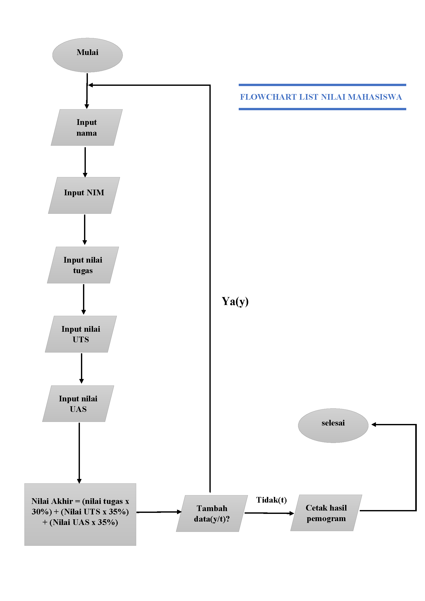
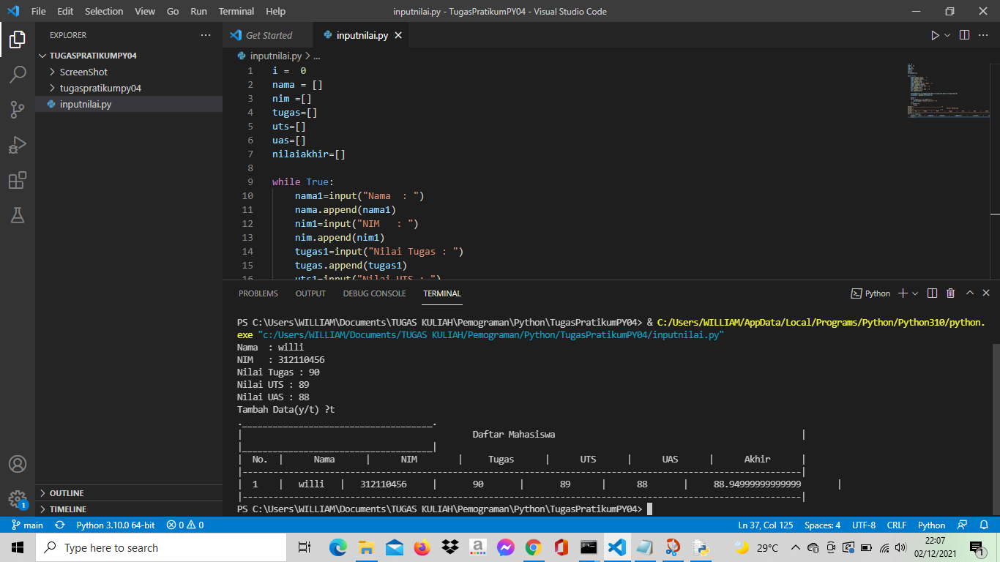
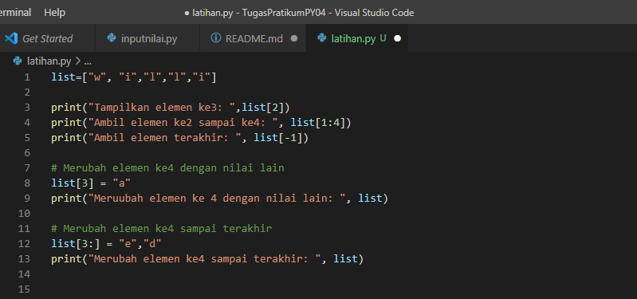
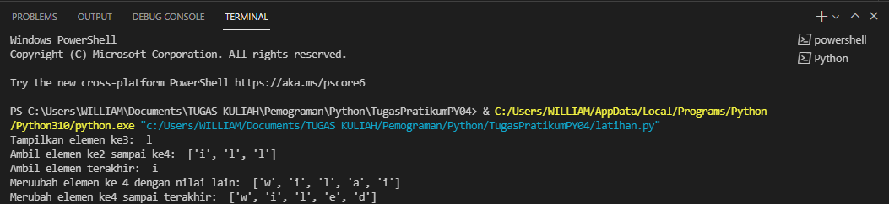
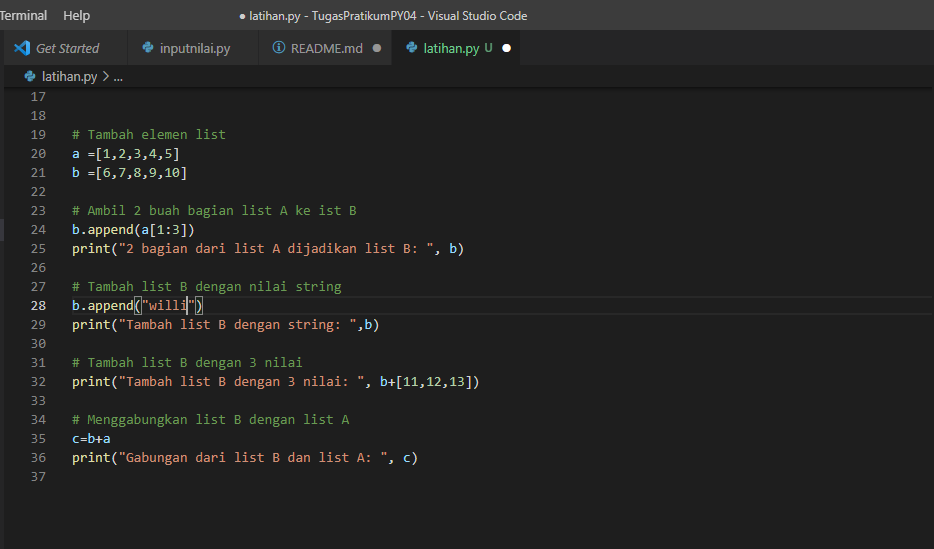
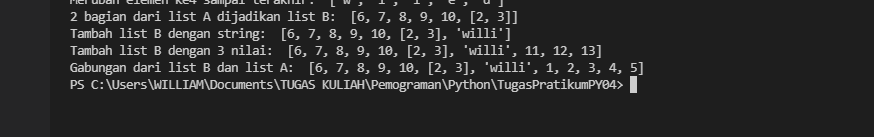

# Membuat List Nilai Mahasiswa
### Berikut flowchartnya:

### Berikut Programnya:

### keterangan
python 
i=0

- diatas adalah untuk menginisiasikan variable i sama dengan 0, karena diprogram ini akan menggunakan perulangan while dan for, jadi perlu menginisiasikan agar tidak terjadi eror
python
nama =[]
nim =[]
tugas=[]
uts=[]
uas=[]
nilaiakhir=[]

- Program di atas untuk mendefinisikan list nya, dan untuk menampung data
python 
while True:
    nama1=input("Nama  : ")
    nama.append(nama1)
    nim1=input("NIM   : ")
    nim.append(nim1)
    tugas1=input("Nilai Tugas : ")
    tugas.append(tugas1)
    uts1=input("Nilai UTS : ")
    uts.append(uts1)
    uas1=input("Nilai UAS : ")
    uas.append(uas1)

    
- diatas adalah code untuk menginput isi dalam list tersebut, juga untuk menambahkan list jika sudah menginput 1 nama atau nilai dalam list, dengan menggunakan append dan menggunakan pengulangan while

python
nilaiakhir1=(int(tugas1)*0.30)+(int(uts1)*0.35)+(int(uas1)*0.35)
nilaiakhir.append(nilaiakhir1)

- diatas adalah code untuk menghitung nilai akhir dengan kondisi nilai akhir 30% dari nilai tugas, ditambah 35% dari nilai UTS dan juga 35% dari nilai UAS, dengan kemudian diubah persentase menjadi bentuk desimal, maka terdapat 0.30, 0.35. sedangkan untuk nilai_akhir.append adalah untuk menambahkan list dari yang telah di inputkan sebelum akhirnya di tampilkan

python
more=""
    while more!="y" and more!="t":
        more=input("Tambah Data(y/t) ?")
    i+=1
    if more=="t":
        break

- Program diatas adalah untuk perintah menambahkan data dengan pertanyaan ya atau tidak, dengan definisi jika ya, maka ketikkan y pada keyboard, maka akan mengulang inputan list. dan jika tidak, ketikkan t paada keyboard, maka akan menampilkan hasil list yang telah di inputkan
python
print("._____________________________________________________________________________________________________________.")
print("|                                             Daftar Mahasiswa                                                |")
print("|_____________________________________________________________________________________________________________|")
print("|  No.  |      Nama      |      NIM        |     Tugas      |      UTS      |      UAS      |      Akhir      |")
print("|-------------------------------------------------------------------------------------------------------------|")

- untuk membuat border agar terlihat rapi dan enak dipandang
python
for n in range(i):
    print("| ",n+1,"   |  ",nama[n],"  |  ",nim[n],"    |      ",tugas[n],"      |      ",uts[n],"     |     ",uas[n],"      |    ",nilaiakhir[n],"      |")
    print("|-------------------------------------------------------------------------------------------------------------|")

- sedangkan ini adalah untuk menampilkan hasil dari list yang telah diinputkan, dengan menggunakan perulangan for n in renge
### Berikut hasil dari programnya


# labspy04  
# latihan1
### Bentuk program di latihan1 yang saya buat

### dengan keterangan 
```python
list=["w", "i","l","l","i"]
```
- diatas adalah isi list nya
```python
print("Tampilkan elemen ke3: ",list[2])
```
- diatas adalah perintah untuk menampilkan elemen ke3 dalam daftar, karna elemen ke3 ada di indeks 2, maka didalam daftar paje kurung siku[2]
```python
print("Ambil elemen ke2 sampai ke4: ", list[1:4])
```
- diatas adalah perintah untuk mengambil elemen ke2 sampai ke4 dengan indeks 1 sampai 4
```python
print("Ambil elemen terakhir: ", list[-1])
```
- sedangkan diatas adalah perintah untuk mengambil elemen terakhir dengan indeks [-1] karna -1 itu keebalikannya, jadi ngambilnya dari akhir
### Mengubah elemen ke4 dengan nilai lain
```python
list[3] = "a" 
```
- perintah di atas adalah unntuk mmerubah elemen ke4 dengan nilai "f" karna elemen ke4 ada di indeks 3, maka di tulis list[3]
```python
print ( " Menambahkan elemen ke4 dengan nilai lain", list )
```
### Mengubah elemen ke4 sampai terakhir
```python
list[3:] = "e","d"
```
- Perintah ini untuk merubah elemen ke4 sampai terkahir dengan string "s" dan "d". Maka ditulis [3:]
```python
print ( "Merubah elemen ke4 sampai terakhir:", list)
```
### Berikut hasil pemrogamannya


## Latihan untuk menambahkan elemen dalam daftar 
### Berikut gambar programnnya:

```python
a=[1,2,3,4,5]
b=[6,7,8,9,10]
```
- diatas adalah list nya
### Mengambili 2 bagian dari list A ke list B
```python
b.append(a[1:3])
print ("2 bagian list A dijadikan list B:",b)
```
- diatas adalah program untuk menambahkan list A kedalam list dengan menggunakan printah append
### Menambahkan list B dengan string
```python
b.append("willi")
print("Tambah list B dengan string:" )
```
- program diatas adalah untuk menambahkan list B dengan string menggunakan append
### Menambahkann daftar B dengan 3 nilai
```python
print(""Tambah list B dengan 3 nilai: ", b + [11,12,13])
```
- diatas adalah program untuk menambahkan list b dengan 3 nilai dengan menggunakan aritmatika +

### Menggabungkan list A dan B
```python
c=b+_a
print("Gabungan list B dan A:", c)
```
- diatas adalah program untuk menggabungkan list B dengan list A
## Berikut hasil dari programnnya:

### Program dari latihan1 telah selesai
## Selesai
# Sekian Terimakasih